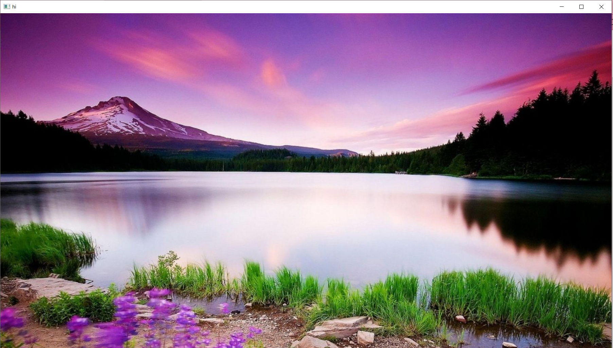
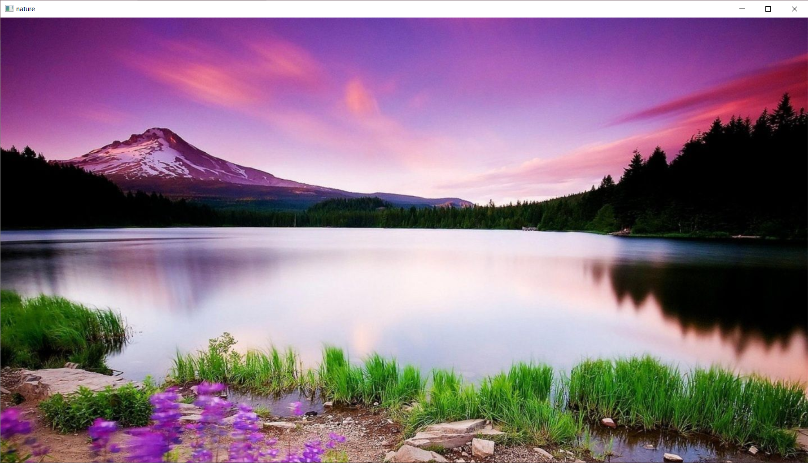

# READ AND WRITE AN IMAGE
## AIM
To write a python program using OpenCV to do the following image manipulations.<br>i) Read, display, and write an image.<br>ii) Access the rows and columns in an image.<br>iii) Cut and paste a small portion of the image.
## Software Required:
Anaconda - Python 3.7
## Algorithm:
### Step1:
Choose an image and save it as a filename.jpg
### Step2:
Use imread(filename, flags) to read the file.
### Step3:
Use imshow(window_name, image) to display the image.
### Step4:
Use imwrite(filename, image) to write the image.
### Step5:
End the program and close the output image windows.
## Program:
### Developed By    : EZHIL MATHI R
### Register Number : 212221230026
i) To Read,display the image
```python
import cv2
a=cv2.imread('1.jpg',1)
cv2.imshow("hi",a)
cv2.waitKey(0)
```
ii) To write the image
```python
import cv2
a=cv2.imread('1.jpg',1)
cv2.imwrite("12.jpg",a)
cv2.imshow("nature",a)
cv2.waitKey(0)
```
iii) Find the shape of the Image
```python
import cv2
a=cv2.imread('1.jpg',1)
print(a.shape)
```
iv) To access rows and columns
```python
import cv2
a=cv2.imread('1.jpg',1)
import random
for i in range(100):
    for j in range(a.shape[1]):
        a[i][j]=[random.randint(0,255),random.randint(0,255),random.randint(0,255)]
cv2.imwrite('12.jpg',a)
cv2.imshow('nothing',a)
cv2.waitKey(0)
```
v) To cut and paste portion of image
```python
import cv2
A=cv2.imread("1.jpg",1)
tag=A[500:700,550:580]
A[450:650,500:530]=tag
cv2.imshow("Nature",A)
cv2.waitKey(0)
```
## Output:
### i) Read and display the image

### ii)Write the image

### iii)Shape of the Image

### iv)Access rows and columns

### v)Cut and paste portion of image

## Result:
Thus the images are read, displayed, and written successfully using the python program.
